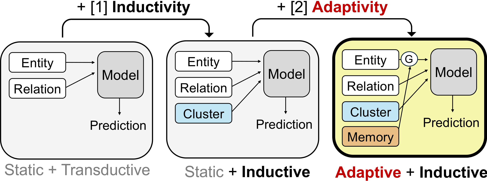
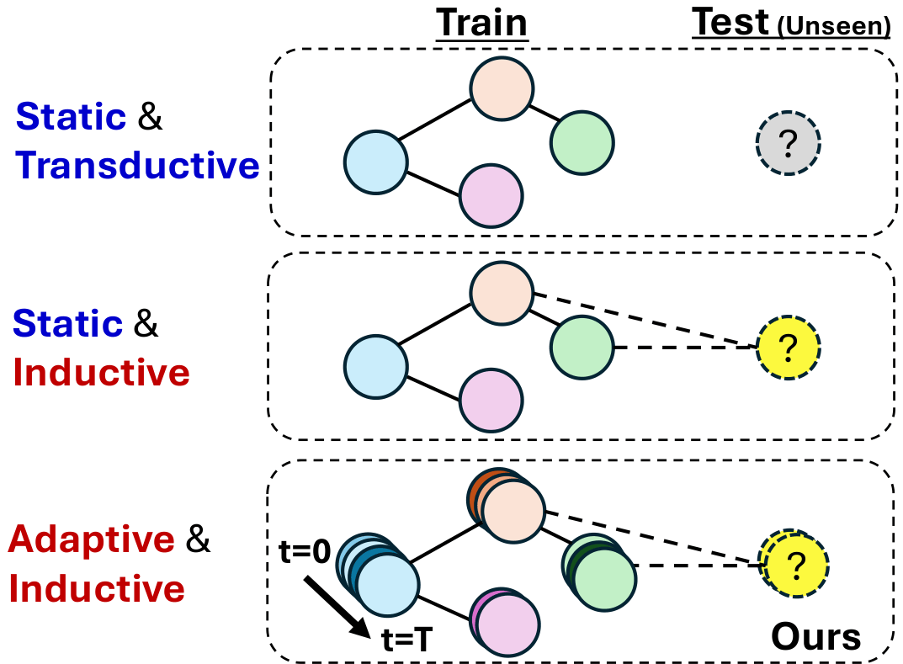

# AdaTKG: Adaptive Memory for Temporal Knowledge Graph Reasoning

<p align="center">
  <a href="https://arxiv.org/pdf/2605.07121"></a>
  <a href="https://opensource.org/licenses/Apache-2.0"></a>
</p>

Implementation of **AdaTKG**, the temporal knowledge graph
(TKG) reasoning method introduced in our paper. 

AdaTKG augments the static-inductive baseline TransFIR with a per-entity online memory governed by an **adaptive gate**, refining each entity's representation every time the entity participates in a fact.

<br>

<p align="center">
  
    &nbsp;&nbsp;&nbsp;&nbsp;&nbsp;&nbsp;&nbsp;
  
</p>

<br>

The repository supports four models reported in the paper:

| Model | `--enhancement` | Description |
|---|---|---|
| **Base**            | `none`       | TransFIR backbone (no per-entity memory). |
| **AdaTKG-EMA**      | `ema`        | Default: learnable EMA with a single shared scalar. |
| **AdaTKG-GRU**      | `meta`       | Online GRU adapter. |
| **AdaTKG-CrossAtt** | `attention`  | Cross-attention readout over a bounded per-entity buffer. |

All four share the same TransFIR backbone and only differ in the memory update rule.

<br>

---

## 1. Installation

```bash
conda create -n adatkg python=3.10 -y
conda activate adatkg
pip install -r requirements.txt
```

<br>

---

## 2. Datasets

We use four standard TKG benchmarks: **ICEWS14**, **ICEWS18**,
**ICEWS05-15**, and **GDELT**. 

Place the raw files under
`data/<DATASET>/` 
- Each folder contains `train.txt`, `valid.txt`, `test.txt`, `entity2id.txt`, `relation2id.txt`.


Then, run the two preprocessing scripts once per dataset:

```bash
# (1) Interaction chain
python data_process.py    --dataset {dataset} --T 14

# (2) Textual entity embedding
python word_embedding.py  --dataset {dataset} --bert_model_path {your_bert_path}
```

<br>

---

## 3. Quick start (best configuration)

The launcher `run_experiment.sh` reads the per-(model, dataset) **best hyperparameter configuration** from `best_configs/<MODEL>.csv` and trains with that single configuration:

```bash
# AdaTKG-EMA on ICEWS14 (default best HP), GPU 0
bash run_experiment.sh AdaTKG-EMA train ICEWS14 0

# AdaTKG-GRU on ICEWS18, GPU 1
bash run_experiment.sh AdaTKG-GRU train ICEWS18 1

# AdaTKG-CrossAtt on GDELT, GPU 0
bash run_experiment.sh AdaTKG-CrossAtt train GDELT 0

# Base (TransFIR) on ICEWS05-15, GPU 0
bash run_experiment.sh Base train ICEWS05-15 0
```

Logs land in `${SAVE_ROOT:-./results}/<EXP_ID>/train_log.txt`. 

<br>

To override the best-HP configuration, pass HP env vars before the
command:

```bash
ML=15 NL=2 HD=512 NC=50 bash run_experiment.sh AdaTKG-EMA train ICEWS14 0
```

<br>

---

## 4. Best hyperparameter configurations

`best_configs/<MODEL>.csv` lists the per-dataset selected HP values:

| File | Model |
|---|---|
| `best_configs/Base.csv`            | TransFIR baseline (its own best HP). |
| `best_configs/AdaTKG-EMA.csv`      | AdaTKG-EMA (default operator). |
| `best_configs/AdaTKG-GRU.csv`      | AdaTKG-GRU. |
| `best_configs/AdaTKG-CrossAtt.csv` | AdaTKG-CrossAtt. |

Each row has columns `model, dataset, max_length, num_layers, hidden_dim, num_code`.

<br>

---

## 5. Repository layout

```
AdaTKG/
├── README.md                 ← this file
├── requirements.txt
├── run_experiment.sh         ← single launcher for all four models
├── best_configs/             ← per-(model, dataset) best HP CSVs
│   ├── Base.csv
│   ├── AdaTKG-EMA.csv
│   ├── AdaTKG-GRU.csv
│   └── AdaTKG-CrossAtt.csv
├── data/                     ← raw datasets + preprocessing caches
├── data_process.py           ← builds interaction-chain cache
├── word_embedding.py         ← builds frozen BERT entity embeddings
├── main.py                   ← Base (TransFIR) training entry point
├── main_enhanced.py          ← AdaTKG variants entry point
├── model.py                  ← TransFIR backbone (frozen, unchanged)
├── model_enhanced.py         ← AdaTKG model wrapper
├── modules_enhanced.py       ← OnlineAdapter / EMAAdapter / AttentionAdapter
├── knowledge_graph.py
└── utils.py
```

<br>

---

## 6. Reproducing the main-paper results

```bash
for DS in ICEWS14 ICEWS18 ICEWS05-15 GDELT; do
    bash run_experiment.sh Base            train ${DS} 0
    bash run_experiment.sh AdaTKG-EMA      train ${DS} 0
    bash run_experiment.sh AdaTKG-GRU      train ${DS} 0
    bash run_experiment.sh AdaTKG-CrossAtt train ${DS} 0
done
```

<br>


---

## 7. Acknowledgement

Our codebase builds on the official [**TransFIR**](https://github.com/zhaodazhuang2333/TransFIR) implementation; the static encoder, VQ codebook, and ConvTransE decoder are adopted from there unchanged, and we adopt the same datasets and chronological train/valid/test splits for fair comparison. 

We thank the TransFIR authors for releasing their code.

---
## Contact

Seunghan Lee — seunghan.lee@lgresearch.ai


